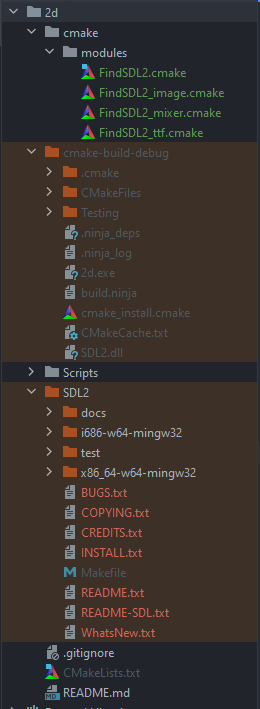

# Clion and SDL2 Setup 

It's been so hard to find a decent guide about how to set up Clion and SDL2, so I made one for my future self and for some random person on internet who find this. I hope it helps you.

We are going to use the bundled MinGw 64 bits version that comes with Clion, if you use 32 bits version you should replace the CMakeList file with the proper directory path and set it as Toolchains in Clion

1. Download the latest [SDL Development Libraries (MinGW version)](https://www.libsdl.org/download-2.0.php)

2. Download the [SDL2 Cmake Scripts](https://github.com/tcbrindle/sdl2-cmake-scripts)

3. Create a cmake/modules directory in your project root and unzip all cmake scripts there.

4. Unzip the SDL Development libraries in your project root, rename the folder to 'SDL2'

5. Mark the SDL2 folder as excluded in Clion (Optional)

6. Download the CMakeLists.txt from this repository, replace "project(PROJECT_NAME)" in line 2 and copy it to your project root

7. Put the SDL2.dll from the SDL2 folder into your cmake-build-debug folder:

- For 64 bits version it's located at x86_64-w65-mingw32/bin/SDL2.dll
- For 32 bits version it's located at i686-w64-mingw32/bin/SDL2.dll

8. Modify the main.cpp signature to look like:

`int main (int argc, char* args[])`

If your exit code is 0 and Clion detects your SDL2 headers then you are good to go.

### Important

* MingGw should be the default toolchains for Clion
* Add SDL2 and cmake folders to the gitignore

### The project tree should look like this
<p align="center">
  
</p>

## Setup SDL2 Image

1. Download the [SDL Image Development Release](https://github.com/libsdl-org/SDL_image/releases)
2. Inside your SDL2 Image folder (downloaded from step 1), select the version you are using for SDL2 and copy it to your SDL2 folder in your project (It won't override anything)
3. Add to the CMakeList:

``` 
set(SDL2_IMAGE_PATH "SDL2/x86_64-w64-mingw32")
find_package(SDL2_image REQUIRED) 
```

**Modify the SDL2_IMAGE_PATH if you are using the 32 bit version**